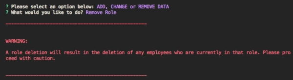
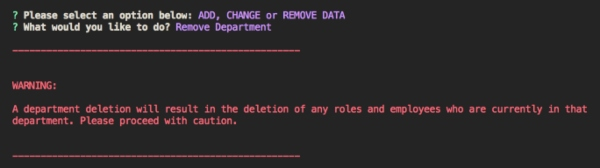
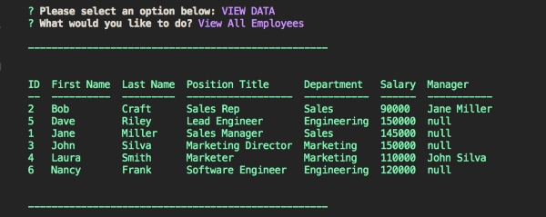

# Employee-Management-System
This CLI operates as a CMS (Content Management System) and uses node, [inquirer](https://www.npmjs.com/package/inquirer), and MySQL for storing, viewing and deleting employee information.

## Table of Contents
* [Installation](#Installation)
* [Usage](#Usage)
* [Demo](#Demo)
* [Future Developments](#Future_Developments)
* [Contact](#Contact)


***
## Installation

Dependencies include:
- [Inquirer](https://www.npmjs.com/package/inquirer) for collecting input
- [MySQL](https://dev.mysql.com/downloads/workbench/) as the database
- [console.table](https://www.npmjs.com/package/console.table)  to format data views
- [Figlet](https://www.npmjs.com/package/figlet) for banner display

To install necessary dependencies, run the following command:
``` 
npm i 
``` 

***
## Usage
- Create a new schema called employees_db in MySQL Workbench using the emsSchema.sql file provided. The schema includes three tables: employees, roles, departments

- **Optional:** The emsSeeds.sql is provided as an optional resource to insert starter data into employees_db. 

- After all dependencies are installed and your schema is created, you will need to change the password for your MySQL connection on line 13 in ems.js before running the following command:
```
node ems
```

- Follow the prompts to add, change, remove or view data.

- If there is no data when you go to view employees, roles or departments, you will get a message that no data exists.

<div style="text-align:center"></div>

- An error message will pop up if you try to add a role or department that already exists. 

<div style="text-align:center"></div>

- **IMPORTANT!** Note that when you delete a role, all employees assigned to that role will also be deleted.

<div style="text-align:center"></div>

- **IMPORTANT!** Note that when you delete a department, all roles and employees assigned to that department will also be deleted.

<div style="text-align:center"></div>

- Deleting a manager will set the Manager field for any former direct reports to null.
<div style="text-align:center"></div>

***
## Demo


***
## Future_Developments
- Validation for prompt inputs
- Fix bug to catch error if duplicate roles or departments entered (currently instated but not case sensitive)
- Ability to view deleted employees, roles and departments
- Ability to reinstate deleted employees, roles and departments
- Ability to view total utilized budget for department (e.g. combined salaries of all employees in a department) 

***
## Contact
- **GitHub:**  [jungjungie](https://github.com/jungjungie)
- **Portfolio:**  [https://jungjungie.github.io/](https://jungjungie.github.io/)
